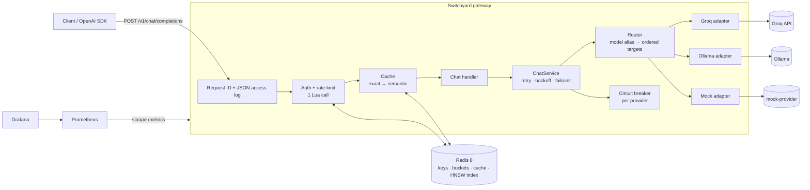

# Switchyard

Switchyard is an OpenAI-compatible LLM inference gateway. Point any OpenAI SDK at it by changing
the base URL. Behind that one endpoint it routes requests across providers (Groq, Ollama, and a
fault-injecting mock), streams tokens back over SSE, and fails cleanly when an upstream
misbehaves. It is built as a production-style service: structured logs, request tracing, typed
config, and tests that exercise real sockets and real failure modes.

> **Status:** Phases 1–5 (core proxy, reliability, auth and rate limiting, caching,
> observability) of 6 are done. Load-test results are in progress. Performance numbers are `TBD` until they
> are measured and saved in `results/`.

## Architecture



## Quick start

Requires Docker with Compose v2 and Python 3.11 (for the tests).

```bash
git clone <this repo> && cd switchyard
make up                      # gateway, 2 mock providers, Redis, Prometheus, Grafana; waits for health
make key NAME=me             # prints a new API key (shown once) as JSON
export KEY=sk-sy-...         # paste the api_key value
curl -s localhost:8000/v1/chat/completions \
  -H "authorization: Bearer $KEY" -H 'content-type: application/json' \
  -d '{"model": "mock", "messages": [{"role": "user", "content": "hello"}]}'
```

The same request from the OpenAI Python SDK:

```python
import os

from openai import OpenAI

client = OpenAI(base_url="http://localhost:8000/v1", api_key=os.environ["KEY"])
for chunk in client.chat.completions.create(
    model="mock", messages=[{"role": "user", "content": "hello"}], stream=True
):
    print(chunk.choices[0].delta.content or "", end="") if chunk.choices else None
```

To use real providers, put `GROQ_API_KEY` in `.env` (copied from `.env.example` by `make up`)
and/or run Ollama on the host, then use `"model": "fast"`.

| Command | What it does |
|---|---|
| `make up` / `make down` | Start / stop the stack |
| `make key NAME=x RPM=60 TPM=100000` | Issue an API key |
| `make test` | Unit and component tests with coverage |
| `make test-integration` | Tests against the running compose stack |
| `make check` | Lint (ruff), type-check (mypy --strict) and tests: what CI runs |

## Features and design decisions

Longer write-ups are in [`docs/decisions.md`](docs/decisions.md).

- **OpenAI-compatible surface.** `POST /v1/chat/completions` (streaming and non-streaming) and
  `GET /v1/models`. Unknown request fields (tools, `response_format`, ...) pass through
  unchanged; errors use the OpenAI error shape, so SDKs raise their usual exceptions.
- **Routing.** A public model name (`fast`, `local`, `mock`) maps to an ordered list of
  `(provider, upstream model)` targets in `config/gateway.yaml`. Callers can pin a provider with
  `"groq/llama-3.1-8b-instant"`.
- **Provider adapters.** One OpenAI-compatible base class with thin Groq, Ollama and mock
  subclasses. Adapters map every upstream failure onto a `FailureKind` that separates
  *retryable* (same provider) from *failover-able* (next provider). [ADR-001, ADR-002]
- **Streaming that fails honestly.** The first upstream chunk is received before the `200` is
  committed, so early failures return real HTTP errors. A failure after that ends the stream
  with an OpenAI-style error event instead of hanging the client. [ADR-003]
- **Timeouts that match streaming.** Separate first-byte, inter-chunk idle, and total
  deadlines, applied per read so a slow *client* is never mistaken for a slow provider.
  [ADR-004]
- **Retries with full-jitter backoff.** Only retryable failures (timeouts, connect errors,
  5xx, 429) are retried, at most `max_attempts` per provider. The provider's `Retry-After` is a
  floor on the delay, and one request-wide deadline bounds the total time. [ADR-008]
- **Circuit breaker per provider.** Closed → open → half-open, driven by the failure *rate*
  over a sliding window, so intermittent failures still trip it. While it is open, the
  provider is skipped at no cost. [ADR-009, ADR-010]
- **Failover.** Targets are tried in priority order. Responses report
  `x-switchyard-attempts` and `x-switchyard-failovers`, and `/status/providers` shows each
  breaker's state.
- **API keys.** `sk-sy-…` keys with 256 bits of entropy, stored only as SHA-256 hashes (why
  not bcrypt: ADR-011). Issue, list, disable and re-limit keys with
  `python -m switchyard.cli keys …`.
- **Atomic token-bucket rate limiting.** Per key, requests/min *and* tokens/min, both checked
  together with authentication in one Redis Lua script: one round trip, atomic across
  processes, all-or-nothing charging, using Redis's clock. Tokens are pre-charged from an
  estimate and reconciled with real usage afterwards. Rejections are `429` with `Retry-After`
  and OpenAI-style `x-ratelimit-*` headers. [ADR-012]
  - *Why a token bucket:* it allows a burst of one minute's allowance, then a smooth rate. It
    avoids the fixed window's doubled burst at window edges, and stores O(1) state per key
    unlike a sliding log.
  - *Proof:* a test fires 400 concurrent admissions from 8 independent connection pools, and
    another fires 150 parallel HTTP requests; both assert the limit holds **exactly**. A
    control test shows a naive GET/SET limiter over-admitting under the same load.
- **Exact-match cache.** Keyed on a SHA-256 of the normalised request. Only
  `temperature: 0` requests are cached unless the caller opts in (`X-Switchyard-Cache: allow`),
  because replaying one *sample* to everyone would change the API's meaning. `Cache-Control:
  no-cache` / `no-store` bypass reads and writes. Streaming and non-streaming callers share
  entries. [ADR-015]
- **Semantic cache, with its threshold chosen from data.** A local sentence-transformers
  embedding (all-MiniLM-L6-v2) finds the nearest cached prompt through a Redis HNSW index, and a
  cross-encoder must confirm the match. The evaluation showed that embedding similarity alone
  can't separate paraphrases from hard negatives at *any* useful threshold (see the table
  below), which is why the second stage exists. [ADR-016]
- **Tracing and logs.** Every response carries `x-request-id` (the caller's, if it is sane).
  Logs are one JSON object per line with the request ID attached, including logs written from
  inside streaming generators.
- **Metrics and dashboard.** `/metrics` exposes request rate, latency histograms (overall,
  time to first token, and gateway overhead: total minus upstream time), cache hits and misses
  per tier, 429s and 401s, circuit-breaker state, failovers, retries, and upstream errors by
  provider and kind. Grafana (http://localhost:3000) provisions a dashboard *generated from
  code* (`scripts/build_dashboard.py`). Label values are always bounded, so a caller can't blow
  up metric cardinality. [ADR-017]
- **Health.** `/healthz` (liveness), `/readyz` (config and Redis only; see ADR-005), and
  `/status/providers` (on-demand upstream probes).
- **Mock provider.** Simulates time to first token, token pacing, HTTP errors, hangs, dropped
  connections and stalled streams. Every setting can be changed at runtime through
  `PATCH /admin/config`, which is how tests and chaos load tests inject faults.

## Benchmarks

### Semantic cache: threshold selection

<!-- generated:semantic-cache -->
Rule: **lowest threshold with false_hit_rate <= 0.01 on every source in the profile** (fixed before running the evaluation).

| Configuration | Threshold | prompts hit / **false hit** | PAWS hit / **false hit** | QQP hit / **false hit** |
|---|---|---|---|---|
| Embedding only, `strict` profile | 1.0 | 0.0% / **0.0%** | 0.1% / **0.0%** | 0.1% / **0.0%** |
| Embedding only, `faq` profile | 0.95 | 23.3% / **9.5%** | 89.1% / **77.5%** | 19.1% / **0.9%** |
| Embedding ≥ 0.8 + `quora-distilroberta-base`, `strict` profile | 0.992 | 8.3% / **0.0%** | 2.6% / **0.6%** | 28.8% / **0.1%** |
| Embedding ≥ 0.8 + `quora-distilroberta-base`, `faq` profile | 0.96 | 43.3% / **5.3%** | 69.1% / **59.5%** | 54.1% / **1.0%** |

Pairs: prompts = 155 (hand-labelled, `data/semantic_pairs.jsonl`), PAWS = 2000, QQP = 2000 (stratified samples, seed 20260925). *Hit* = share of true paraphrase pairs matched; *false hit* = share of non-paraphrase pairs matched, i.e. a wrong answer served.

Latency on Apple M5 Pro: embedding p50 2.693 ms / p95 3.204 ms per prompt; verifier `quora-distilroberta-base` p50 6.257 ms / p95 10.311 ms per pair.

Source: [`results/semantic-threshold/20260925T184805Z`](results/semantic-threshold/20260925T184805Z/metrics.json)
<!-- /generated:semantic-cache -->

Reproduce with `pip install -e '.[eval]' && python scripts/eval_semantic_threshold.py
--verifier cross-encoder/quora-distilroberta-base`.

### Gateway load tests

`TBD`: Phase 6. Tables will be generated from `results/`.

## Failure modes

| Failure | Behaviour |
|---|---|
| Upstream 5xx / 429 / timeout / connect error before first byte | Retry with backoff, then fail over to the next target; `502`/`504` only if every target fails |
| Upstream hangs | Cut off at `first_byte_s` (stream) or `total_s`, then retry or fail over |
| Provider keeps failing | Breaker opens; the provider is skipped without paying a timeout; trial call after `open_s` |
| Every provider's breaker is open | `503 all_circuits_open` with `Retry-After` |
| Upstream 400 / 422 | Not retried or failed over; passed through with upstream status and message |
| Upstream 401 / 403 | Fail over (our credentials, not the caller's problem); `502` if nothing else works |
| Connection dropped or stalled mid-stream | Error SSE event, stream ends within `idle_s`, no `[DONE]`; counts against the breaker; never spliced onto another provider |
| Client disconnects mid-stream | Upstream request is closed; breaker is not charged |
| Retries exceed the request budget | `504 request_timeout` at `request_timeout_s` |
| Unknown model | `404 model_not_found` |
| Missing, unknown or disabled API key | `401 invalid_api_key` |
| Key over its requests/min or tokens/min limit | `429 rate_limit_exceeded` + `Retry-After`; nothing charged |
| Single request larger than the key's tokens/min | `400 tokens_exceed_limit` (it could never succeed) |
| Cache (Redis) error during lookup or store | Treated as a miss; request proceeds |
| Redis unreachable | `503 auth_unavailable` (fail closed, ADR-013); `/readyz` → 503 |

## Limitations

`TBD`: written once the load tests exist.

## License

MIT
