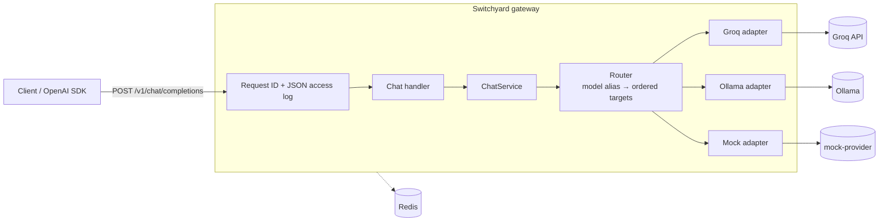

# Switchyard

Switchyard is an OpenAI-compatible LLM inference gateway. Point any OpenAI SDK at it by changing
the base URL. Behind that one endpoint it routes requests across providers (Groq, Ollama, and a
fault-injecting mock), streams tokens back over SSE, and fails cleanly when an upstream
misbehaves. It is built as a production-style service: structured logs, request tracing, typed
config, and tests that exercise real sockets and real failure modes.

> **Status:** Phase 1 (core proxy) of 6 is done. Reliability, rate limiting, caching,
> observability and load-test results are in progress. Performance numbers are `TBD` until they
> are measured and saved in `results/`.

## Architecture



## Quick start

Requires Docker with Compose v2 and Python 3.11 (for the tests).

```bash
git clone <this repo> && cd switchyard
make up            # builds and starts gateway, 2 mock providers and Redis; waits for health
curl -s localhost:8000/v1/chat/completions \
  -H 'content-type: application/json' \
  -d '{"model": "mock", "messages": [{"role": "user", "content": "hello"}]}'
```

The same request from the OpenAI Python SDK:

```python
from openai import OpenAI

client = OpenAI(base_url="http://localhost:8000/v1", api_key="unused")
for chunk in client.chat.completions.create(
    model="mock", messages=[{"role": "user", "content": "hello"}], stream=True
):
    print(chunk.choices[0].delta.content or "", end="") if chunk.choices else None
```

To use real providers, put `GROQ_API_KEY` in `.env` (copied from `.env.example` by `make up`)
and/or run Ollama on the host, then use `"model": "fast"`.

| Command | What it does |
|---|---|
| `make up` / `make down` | Start / stop the stack |
| `make test` | Unit and component tests with coverage |
| `make test-integration` | Tests against the running compose stack |
| `make check` | Lint (ruff), type-check (mypy --strict) and tests: what CI runs |

## Features and design decisions

Longer write-ups are in [`docs/decisions.md`](docs/decisions.md).

- **OpenAI-compatible surface.** `POST /v1/chat/completions` (streaming and non-streaming) and
  `GET /v1/models`. Unknown request fields (tools, `response_format`, ...) pass through
  unchanged; errors use the OpenAI error shape, so SDKs raise their usual exceptions.
- **Routing.** A public model name (`fast`, `local`, `mock`) maps to an ordered list of
  `(provider, upstream model)` targets in `config/gateway.yaml`. Callers can pin a provider with
  `"groq/llama-3.1-8b-instant"`.
- **Provider adapters.** One OpenAI-compatible base class with thin Groq, Ollama and mock
  subclasses. Adapters map every upstream failure onto a `FailureKind` that separates
  *retryable* (same provider) from *failover-able* (next provider). [ADR-001, ADR-002]
- **Streaming that fails honestly.** The first upstream chunk is received before the `200` is
  committed, so early failures return real HTTP errors. A failure after that ends the stream
  with an OpenAI-style error event instead of hanging the client. [ADR-003]
- **Timeouts that match streaming.** Separate first-byte, inter-chunk idle, and total
  deadlines, applied per read so a slow *client* is never mistaken for a slow provider.
  [ADR-004]
- **Tracing and logs.** Every response carries `x-request-id` (the caller's, if it is sane).
  Logs are one JSON object per line with the request ID attached, including logs written from
  inside streaming generators.
- **Health.** `/healthz` (liveness), `/readyz` (own dependencies only; see ADR-005), and
  `/status/providers` (on-demand upstream probes).
- **Mock provider.** Simulates time to first token, token pacing, HTTP errors, hangs, dropped
  connections and stalled streams. Every setting can be changed at runtime through
  `PATCH /admin/config`, which is how tests and chaos load tests inject faults.

## Benchmarks

`TBD`: Phase 6. Tables will be generated from `results/`.

## Failure modes

| Failure | Behaviour today |
|---|---|
| Upstream 5xx / 429 / connect error before first byte | `502` in OpenAI error format |
| Upstream hangs | `504` after `first_byte_s` (streaming) or `total_s` |
| Upstream 400 / 422 | Passed through with upstream status and message |
| Upstream 401 / 403 | `502`; upstream message is not exposed |
| Connection dropped or stalled mid-stream | Error SSE event, stream closed within `idle_s`, no `[DONE]` |
| Unknown model | `404 model_not_found` |

Retries, circuit breaking and failover arrive in Phase 2.

## Limitations

`TBD`: written once the load tests exist.

## License

MIT
