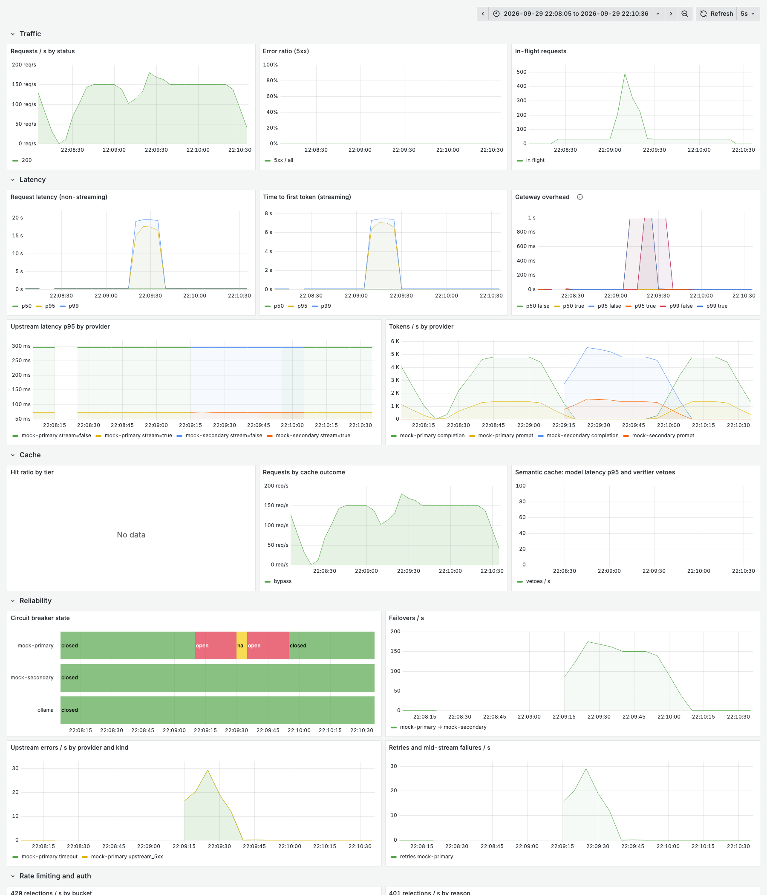

# Switchyard

Switchyard is an OpenAI-compatible LLM inference gateway. Point any OpenAI SDK at it by changing
the base URL. Behind that one endpoint it routes requests across providers (Groq, Ollama, and a
fault-injecting mock), streams tokens back over SSE, and fails cleanly when an upstream
misbehaves. It is built as a production-style service: structured logs, request tracing, typed
config, and tests that exercise real sockets and real failure modes.

Every number in this README is generated by `scripts/render_readme.py` from files in
[`results/`](results/), and CI fails if the two disagree. The load tests hit only the mock
providers, never a real LLM API.

## Architecture

```mermaid
flowchart LR
    C[Client / OpenAI SDK] -->|POST /v1/chat/completions| LS
    subgraph GW[Switchyard gateway]
        LS[Load shedding<br/>event-loop lag] --> MW
        MW[Request ID + JSON access log] --> AU[Auth + rate limit<br/>1 Lua call]
        AU --> CA[Cache<br/>exact → semantic (opt-in)]
        CA --> H[Chat handler]
        H --> S[ChatService<br/>retry · backoff · failover]
        S --> R[Router<br/>model alias → ordered targets]
        S --> CB[Circuit breaker<br/>per provider]
        R --> A1[Groq adapter]
        R --> A2[Ollama adapter]
        R --> A3[Mock adapter]
    end
    A1 --> G[(Groq API)]
    A2 --> O[(Ollama)]
    A3 --> M[(mock-provider)]
    AU <--> RD[(Redis 8<br/>keys · buckets · cache · HNSW index)]
    CA <--> RD
    P[Prometheus] -->|scrape /metrics| GW
    GF[Grafana] --> P
```

## Quick start

Requires Docker with Compose v2 and Python 3.11 (for the tests).

```bash
git clone <this repo> && cd switchyard
make up                      # gateway, 2 mock providers, Redis, Prometheus, Grafana; waits for health
make key NAME=me             # prints a new API key (shown once) as JSON
export KEY=sk-sy-...         # paste the api_key value
curl -s localhost:8000/v1/chat/completions \
  -H "authorization: Bearer $KEY" -H 'content-type: application/json' \
  -d '{"model": "mock", "messages": [{"role": "user", "content": "hello"}]}'
```

The same request from the OpenAI Python SDK:

```python
import os

from openai import OpenAI

client = OpenAI(base_url="http://localhost:8000/v1", api_key=os.environ["KEY"])
for chunk in client.chat.completions.create(
    model="mock", messages=[{"role": "user", "content": "hello"}], stream=True
):
    print(chunk.choices[0].delta.content or "", end="") if chunk.choices else None
```

To use real providers, put `GROQ_API_KEY` in `.env` (copied from `.env.example` by `make up`)
and/or run Ollama on the host, then use `"model": "fast"`. The semantic cache is off by
default. To try it, build with its models (`make up SEMANTIC=1`) and set
`cache.semantic.enabled: true` in `config/gateway.yaml`.

| Command | What it does |
|---|---|
| `make up` / `make down` | Start / stop the stack |
| `make key NAME=x RPM=60 TPM=100000` | Issue an API key |
| `make test` | Unit and component tests with coverage |
| `make test-integration` | Tests against the running compose stack |
| `make check` | Lint (ruff), type-check (mypy --strict) and tests: what CI runs |
| `make loadtest` | Every k6 scenario against the mocks (~1 h); results to `results/loadtest/`, README refreshed |
| `make eval-semantic` | Re-run the semantic-cache threshold evaluation |

## Features and design decisions

Longer write-ups are in [`docs/decisions.md`](docs/decisions.md).

- **OpenAI-compatible surface.** `POST /v1/chat/completions` (streaming and non-streaming) and
  `GET /v1/models`. Unknown request fields (tools, `response_format`, ...) pass through
  unchanged; errors use the OpenAI error shape, so SDKs raise their usual exceptions.
- **Routing.** A public model name (`fast`, `local`, `mock`) maps to an ordered list of
  `(provider, upstream model)` targets in `config/gateway.yaml`. Callers can pin a provider with
  `"groq/llama-3.1-8b-instant"`.
- **Provider adapters.** One OpenAI-compatible base class with thin Groq, Ollama and mock
  subclasses. Adapters map every upstream failure onto a `FailureKind` that separates
  *retryable* (same provider) from *failover-able* (next provider). [ADR-001, ADR-002]
- **Streaming that fails honestly.** The first upstream chunk is received before the `200` is
  committed, so early failures return real HTTP errors. A failure after that ends the stream
  with an OpenAI-style error event instead of hanging the client. [ADR-003]
- **Timeouts that match streaming.** Separate first-byte, inter-chunk idle, and total
  deadlines, applied per read so a slow *client* is never mistaken for a slow provider.
  [ADR-004]
- **Retries with full-jitter backoff.** Only retryable failures (timeouts, connect errors,
  5xx, 429) are retried, at most `max_attempts` per provider. The provider's `Retry-After` is a
  floor on the delay, and one request-wide deadline bounds the total time. [ADR-008]
- **Circuit breaker per provider.** Closed → open → half-open, driven by the failure *rate*
  over a sliding window, so intermittent failures still trip it. While it is open, the
  provider is skipped at no cost. [ADR-009, ADR-010]
- **Failover.** Targets are tried in priority order. Responses report
  `x-switchyard-attempts` and `x-switchyard-failovers`, and `/status/providers` shows each
  breaker's state.
- **API keys.** `sk-sy-…` keys with 256 bits of entropy, stored only as SHA-256 hashes (why
  not bcrypt: ADR-011). Issue, list, disable and re-limit keys with
  `python -m switchyard.cli keys …`.
- **Atomic token-bucket rate limiting.** Per key, requests/min *and* tokens/min, both checked
  together with authentication in one Redis Lua script: one round trip, atomic across
  processes, all-or-nothing charging, using Redis's clock. Tokens are pre-charged from an
  estimate and reconciled with real usage afterwards. Rejections are `429` with `Retry-After`
  and OpenAI-style `x-ratelimit-*` headers. [ADR-012]
  - *Why a token bucket:* it allows a burst of one minute's allowance, then a smooth rate. It
    avoids the fixed window's doubled burst at window edges, and stores O(1) state per key
    unlike a sliding log.
  - *Proof:* a test fires 400 concurrent admissions from 8 independent connection pools, and
    another fires 150 parallel HTTP requests; both assert the limit holds **exactly**. A
    control test shows a naive GET/SET limiter over-admitting under the same load.
- **Exact-match cache.** Keyed on a SHA-256 of the normalised request. Only
  `temperature: 0` requests are cached unless the caller opts in (`X-Switchyard-Cache: allow`),
  because replaying one *sample* to everyone would change the API's meaning. `Cache-Control:
  no-cache` / `no-store` bypass reads and writes. Streaming and non-streaming callers share
  entries. [ADR-015]
- **Semantic cache, with its threshold chosen from data (opt-in).** A local
  sentence-transformers embedding (all-MiniLM-L6-v2) finds the nearest cached prompt through a
  Redis HNSW index, and a cross-encoder must confirm the match. The evaluation showed that
  embedding similarity alone can't separate paraphrases from hard negatives at *any* useful
  threshold, which is why the second stage exists [ADR-016]. Both models are micro-batched, and
  the tier has a latency budget: past it, the lookup counts as a miss. It ships **disabled**,
  because on CPU in a container it costs more latency than it saves (see *Cache mix* below)
  [ADR-021].
- **Load shedding.** When event-loop lag shows the process is saturated, new chat requests get
  a fast `503` + `Retry-After` instead of everyone slowing down together [ADR-020].
- **Sharded upstream pools.** Each provider's connections are split across several httpx
  clients behind semaphores. Profiling under load showed httpcore's pool bookkeeping
  dominating CPU with one large pool [ADR-019].
- **Tracing and logs.** Every response carries `x-request-id` (the caller's, if it is sane).
  Logs are one JSON object per line with the request ID attached, including logs written from
  inside streaming generators.
- **Metrics and dashboard.** `/metrics` exposes request rate, latency histograms (overall,
  time to first token, and gateway overhead: total minus upstream time), cache hits and misses
  per tier, 429s and 401s, circuit-breaker state, failovers, retries, and upstream errors by
  provider and kind. Grafana (http://localhost:3000) provisions a dashboard *generated from
  code* (`scripts/build_dashboard.py`). Label values are always bounded, so a caller can't blow
  up metric cardinality. [ADR-017]
- **Health.** `/healthz` (liveness), `/readyz` (config and Redis only; see ADR-005),
  `/status/providers` (on-demand upstream probes and breaker state) and `/status/cache`.
- **Mock provider.** Simulates time to first token, token pacing, HTTP errors, hangs, dropped
  connections and stalled streams. Every setting can be changed at runtime through
  `PATCH /admin/config`, which is how tests and chaos load tests inject faults.

## Benchmarks

### Semantic cache: threshold selection

<!-- generated:semantic-cache -->
Rule: **lowest threshold with false_hit_rate <= 0.01 on every source in the profile** (fixed before running the evaluation).

| Configuration | Threshold | prompts hit / **false hit** | PAWS hit / **false hit** | QQP hit / **false hit** |
|---|---|---|---|---|
| Embedding only, `strict` profile | 1.0 | 0.0% / **0.0%** | 0.1% / **0.0%** | 0.1% / **0.0%** |
| Embedding only, `faq` profile | 0.95 | 23.3% / **9.5%** | 89.1% / **77.5%** | 19.1% / **0.9%** |
| Embedding ≥ 0.8 + `quora-distilroberta-base`, `strict` profile | 0.992 | 8.3% / **0.0%** | 2.6% / **0.6%** | 28.8% / **0.1%** |
| Embedding ≥ 0.8 + `quora-distilroberta-base`, `faq` profile | 0.96 | 43.3% / **5.3%** | 69.1% / **59.5%** | 54.1% / **1.0%** |

Pairs: prompts = 155 (hand-labelled, `data/semantic_pairs.jsonl`), PAWS = 2000, QQP = 2000 (stratified samples, seed 20260925). *Hit* = share of true paraphrase pairs matched; *false hit* = share of non-paraphrase pairs matched, i.e. a wrong answer served.

Latency on Apple M5 Pro: embedding p50 2.693 ms / p95 3.204 ms per prompt; verifier `quora-distilroberta-base` p50 6.257 ms / p95 10.311 ms per pair.

Source: [`results/semantic-threshold/20260925T184805Z`](results/semantic-threshold/20260925T184805Z/metrics.json)
<!-- /generated:semantic-cache -->

Reproduce with `pip install -e '.[eval]' && python scripts/eval_semantic_threshold.py
--verifier cross-encoder/quora-distilroberta-base`.

### Gateway load tests

<!-- generated:loadtest-env -->
**Hardware:** Apple M5 Pro (15 cores, 24.0 GB) running Docker 29.5.2 in a Colima VM with 6 vCPUs and 7.7 GB (aarch64 docker). Gateway, mocks, Redis, Prometheus and k6 share the same VM. The gateway is one uvicorn process (one core); each mock is one process; k6 is limited to 2 CPUs. k6: `grafana/k6:1.2.2`. Mock providers: ~50 ms to first token, 32 tokens at 5 ms each (~210 ms per non-streaming call). Every run directory also holds the gateway config, mock settings, k6 scripts, raw k6 summary and raw Prometheus data.
<!-- /generated:loadtest-env -->

Each scenario is a k6 script in [`loadtest/`](loadtest/). k6 runs in a container on the Compose
network, and [`loadtest/run.py`](loadtest/run.py) restarts the gateway with the run's config
before each run. [`loadtest/analyze.py`](loadtest/analyze.py) recomputes every number below
from the saved raw files.

#### (a) Throughput and latency under increasing load

Non-streaming, cache-bypass requests; open-model load (fixed arrival rate per 30 s step).

<!-- generated:loadtest-ramp -->
Rule: sustainable = error <= 1%, no dropped iterations, p99 <= 2x lightest-step p99.

| Offered req/s | Successful req/s | Errors | p50 | p95 | p99 | Overhead p50 / p99 (server) | p50 over mock-direct | Shed |
|---|---|---|---|---|---|---|---|---|
| 50 | 50.0 | 0.0% | 215.5 | 219.2 | 227.7 | 1.1 / 3.7 ms | +3.1 ms | 0 |
| 100 | 100.0 | 0.0% | 213.8 | 217.1 | 223.7 | 0.9 / 3.2 ms | +2.8 ms | 0 |
| 200 | 200.0 | 0.0% | 212.4 | 215.4 | 222.8 | 0.5 / 2.6 ms | +1.8 ms | 0 |
| 300 | 300.0 | 0.0% | 213.2 | 224.6 | 259.2 | 0.7 / 12.6 ms | +2.7 ms | 0 |
| 400 | 279.8 | 19.59% | 3,277.6 | 8,742.1 | 11,346.2 | 62.1 / 275.4 ms | +3067.1 ms | 1991 |
| 500 | 221.8 | 53.88% | 1,813.3 | 6,091.7 | 11,067.6 | 87.1 / 640.8 ms | +1602.8 ms | 7765 |
| 600 | 191.9 | 65.6% | 1,644.4 | 7,570.1 | 22,592.0 | 101.1 / 467.1 ms | +1434.1 ms | 10987 |
| 800 | 186.2 | 75.32% | 1,956.7 | 6,577.6 | 20,369.4 | 137.2 / 469.0 ms | +1746.3 ms | 16987 |
| 1000 | 205.8 | 76.74% | 2,063.2 | 28,874.9 | 29,918.8 | 151.4 / 485.1 ms | +1852.7 ms | 19827 |

Latencies are client-side (k6) for successful requests, in ms. *Overhead (server)* is the gateway's own histogram: total time minus the upstream call. *p50 over mock-direct* compares with k6 hitting the mock directly at the same rate.

**Variants** (same steps; the headline rule applied to each):

| Variant | Max sustainable req/s | Peak successful req/s | p99 at max (ms) | Run |
|---|---|---|---|---|
| As shipped (sharded pools, load shedding) | 300 | 300.0 | 259.2 | [`20260930T022056Z__ramp__default`](results/loadtest/20260930T022056Z__ramp__default) |
| Load shedding off | 300 | 300.0 | 281.3 | [`20260930T022717Z__ramp__no-shedding`](results/loadtest/20260930T022717Z__ramp__no-shedding) |
| Single httpx pool per provider, no shedding (pre-fix) | 200 | 213.9 | 225.3 | [`20260930T023346Z__ramp__single-httpx-pool`](results/loadtest/20260930T023346Z__ramp__single-httpx-pool) |
| Streaming requests | 200 | 318.4 | 383.0 | [`20260930T024025Z__ramp__streaming`](results/loadtest/20260930T024025Z__ramp__streaming) |
| Mock alone (no gateway): baseline | 1000 | 1000.1 | 224.9 | [`20260930T024638Z__ramp__mock-direct`](results/loadtest/20260930T024638Z__ramp__mock-direct) |
<!-- /generated:loadtest-ramp -->

#### Streaming: time to first token

<!-- generated:loadtest-streaming -->
| Offered req/s | Successful req/s | Errors | TTFT p50 / p95 / p99 (server) | TTFB p50 / p99 (client) | Overhead to first byte p50 / p99 |
|---|---|---|---|---|---|
| 50 | 50.0 | 0.0% | 62.5 / 73.8 / 74.8 ms | 53.3 / 58.1 ms | 0.7 / 2.7 ms |
| 100 | 100.0 | 0.0% | 62.5 / 73.8 / 74.8 ms | 53.0 / 62.4 ms | 0.7 / 3.1 ms |
| 200 | 200.0 | 0.0% | 65.2 / 126.2 / 181.1 ms | 56.1 / 187.3 ms | 1.5 / 33.3 ms |
| 300 | 296.2 | 1.04% | 302.9 / 503.7 / 735.7 ms | 348.0 / 942.2 ms | 53.4 / 243.7 ms |
| 400 | 309.5 | 21.86% | 451.8 / 719.5 / 745.6 ms | 481.1 / 2,922.5 ms | 86.0 / 247.7 ms |
| 500 | 318.4 | 35.05% | 510.4 / 732.2 / 826.8 ms | 405.7 / 3,541.7 ms | 93.9 / 249.7 ms |
| 600 | 303.2 | 47.6% | 547.9 / 962.6 / 1,326.4 ms | 275.3 / 7,128.1 ms | 103.5 / 450.7 ms |
| 800 | 292.2 | 61.92% | 574.2 / 971.1 / 1,334.6 ms | 127.1 / 6,362.6 ms | 114.9 / 466.9 ms |
| 1000 | 277.1 | 71.7% | 673.4 / 1,330.1 / 1,491.2 ms | 113.6 / 2,979.2 ms | 152.1 / 485.2 ms |

TTFT = request received to first *content* token sent (the mock's first content token comes ~5 ms after its role chunk). TTFB is measured by k6. Source: [`20260930T024025Z__ramp__streaming`](results/loadtest/20260930T024025Z__ramp__streaming)
<!-- /generated:loadtest-streaming -->

#### (b) Steady load with a realistic cache mix

<!-- generated:loadtest-cache -->
200 req/s for 180s; 80% of requests ask one of 1,000 questions with Zipf(1.1) popularity (15% of those re-typed in lower case without punctuation), 20% are one-off prompts; half stream; all `temperature: 0`. Latency in ms (client-side, successful requests).

| Configuration | req/s | Failed | Exact hits | Semantic hits | Hit p50 / p99 | Miss p50 / p99 | Run |
|---|---|---|---|---|---|---|---|
| Exact only (as shipped) | 200.0 | 0 | 75.4% | 0.00% | 0.8 / 2.6 | 213.8 / 229.7 | [`20260930T025250Z__steady__default`](results/loadtest/20260930T025250Z__steady__default) |
| Exact + semantic, 50 ms budget | 200.0 | 0 | 75.4% | 0.01% | 1.5 / 8.3 | 264.7 / 354.2 | [`20260930T025611Z__steady__semantic`](results/loadtest/20260930T025611Z__steady__semantic) |
| Exact + semantic, 250 ms budget | 199.8 | 99 | 75.2% | 0.15% | 2.0 / 89.9 | 467.1 / 637.8 | [`20260930T025932Z__steady__semantic-budget-250ms`](results/loadtest/20260930T025932Z__steady__semantic-budget-250ms) |
<!-- /generated:loadtest-cache -->

With the semantic tier on, misses slow down by its budget and hits stay rare. With the larger
budget, the models' CPU work starves the event loop enough that some Redis and upstream
deadlines are missed, and those requests fail: the reason the tier ships disabled (ADR-021).

#### (c) Chaos: the primary provider fails mid-test

<!-- generated:loadtest-chaos -->
150 req/s (half streaming) for 120 s; the primary mock is broken at 40 s and repaired at 80 s; `mock-secondary` is the failover target.

| Fault | Failed / sent during fault | p99 before → during (ms) | Breaker opened after | Recovery time | Primary back after repair | Run |
|---|---|---|---|---|---|---|
| Primary returns 500 on every call | 0 / 6000 (0.0%) | 239.3 → 242.0 | 0.04 s | 0 s | 1 s | [`20260930T030546Z__chaos__errors`](results/loadtest/20260930T030546Z__chaos__errors) |
| Primary accepts and never answers | 0 / 5745 (0.0%) | 237.4 → 15,255.2 | 5.15 s | 7 s | 10 s | [`20260930T030807Z__chaos__hang`](results/loadtest/20260930T030807Z__chaos__hang) |
| Primary drops streams after 3 tokens | 64 / 6000 (1.067%) | 240.2 → 238.0 | 0.32 s | 33 s | 3 s | [`20260930T031028Z__chaos__drop`](results/loadtest/20260930T031028Z__chaos__drop) |

Recovery rule: recovery = seconds from fault injection until every following second (while the fault lasts) has 0 failed requests and p95 <= max(1.5x, +50 ms) of pre-fault p95.
<!-- /generated:loadtest-chaos -->

<!-- generated:grafana-screenshot -->


*The provisioned Grafana dashboard over the window of run `20260930T030807Z__chaos__hang` (the primary mock is broken mid-run, so traffic fails over and the breaker opens). Captured by `scripts/grafana_screenshot.py`.*
<!-- /generated:grafana-screenshot -->

#### (d) Rate-limit burst

<!-- generated:loadtest-burst -->
| Key limit | Burst sent / admitted | Bucket capacity | Admitted in total / theoretical max | Worst excess over bound | Steady-state admission | 429 p50 / p99 | 200 p50 / p99 | Other statuses |
|---|---|---|---|---|---|---|---|---|
| 300 req/min | 2000 / 304 | 300 | 649 / 650 | -0.05 requests | 5.0 req/s (refill 5/s) | 2.3 / 185.8 ms | 139.5 / 446.9 ms | none |

The bound is `capacity + refill * elapsed`, checked against every admitted request using client-side send times (so it is slightly *stricter* than what the server saw). Source: [`20260930T031249Z__burst__default`](results/loadtest/20260930T031249Z__burst__default)
<!-- /generated:loadtest-burst -->

### What load testing changed

The first load tests failed badly, and every fix below is in the code with an ADR:

- **File descriptors.** Docker's default limit of 1024 open files capped connections, and
  clients saw EOFs. Raised to 65536 (ADR-018).
- **Keep-alive race.** The gateway's pool and the upstream both expired idle connections after
  5 s, so requests were sometimes written onto a connection the server was closing. The pool now
  expires first (ADR-018).
- **Connection-pool CPU.** With one httpx pool per provider, the pool's own bookkeeping took
  most of the CPU, and throughput *fell* past saturation. Sharding the pool fixed it: compare
  the pre-fix and as-shipped variants above (ADR-019).
- **Overload.** Past saturation, latency grew without bound for everyone. Load shedding now
  refuses the excess instead (ADR-020).
- **Semantic cache.** The models run far slower in a Linux container than natively on the host.
  Micro-batching, a latency budget and shipping the tier off by default followed (ADR-021).

## Failure modes

| Failure | Behaviour |
|---|---|
| Upstream 5xx / 429 / timeout / connect error before first byte | Retry with backoff, then fail over to the next target; `502`/`504` only if every target fails |
| Upstream hangs | Cut off at `first_byte_s` (stream) or `total_s`, then retry or fail over |
| Provider keeps failing | Breaker opens; the provider is skipped without paying a timeout; trial call after `open_s` |
| Provider hangs (accepts, never answers) | No evidence until the first timeouts fire, so requests sent in that window wait up to the timeout before failing over; each half-open trial is a real request and waits the full timeout too (see chaos results) |
| Provider fails only streaming requests | A non-streaming trial call can close the breaker, so a few streams fail per `open_s` cycle until the next trip (see chaos results) |
| Every provider's breaker is open | `503 all_circuits_open` with `Retry-After` |
| Upstream 400 / 422 | Not retried or failed over; passed through with upstream status and message |
| Upstream 401 / 403 | Fail over (our credentials, not the caller's problem); `502` if nothing else works |
| Connection dropped or stalled mid-stream | Error SSE event, stream ends within `idle_s`, no `[DONE]`; counts against the breaker; never spliced onto another provider |
| Client disconnects mid-stream | Upstream request is closed; breaker is not charged |
| Retries exceed the request budget | `504 request_timeout` at `request_timeout_s` |
| Unknown model | `404 model_not_found` |
| Missing, unknown or disabled API key | `401 invalid_api_key` |
| Key over its requests/min or tokens/min limit | `429 rate_limit_exceeded` + `Retry-After`; nothing charged |
| Single request larger than the key's tokens/min | `400 tokens_exceed_limit` (it could never succeed) |
| Cache (Redis) error during lookup or store | Treated as a miss; request proceeds |
| Semantic tier slow or saturated | Lookup skipped at its budget or queue limit; counted as a miss |
| Gateway CPU-saturated (event-loop lag) | New chat requests get `503 gateway_overloaded` + `Retry-After: 1`; health checks unaffected |
| Redis unreachable | `503 auth_unavailable` (fail closed, ADR-013); `/readyz` → 503 |

## Limitations

- **Single node, single process.** The gateway is one uvicorn process on one core. Circuit
  breakers and metrics are per process (ADR-010, ADR-017), so N replicas would each need to
  learn separately that a provider is bad.
- **Local hardware.** Everything, including k6, shares one laptop VM, so the load generator
  competes with the system under test. The absolute numbers describe this machine, not a
  server. Relative comparisons between variants are the more meaningful result.
- **A mock, not a model.** The mock streams deterministic text with fixed timing. Real providers
  have long-tailed latency, token-dependent generation time and their own rate limits, none of
  which the mock reproduces. The gateway's own costs (overhead, shedding, rate limiting,
  failover) are what these numbers measure.
- **Token counts are estimates until the provider reports usage.** Rate limiting pre-charges a
  chars/4 estimate and reconciles afterwards (ADR-012).
- **The semantic cache is safe but rarely useful here.** At the ≤ 1% false-hit rule it matches
  few paraphrases (see the evaluation table), and on CPU its models cost more latency than a
  hit saves against a ~210 ms upstream. The threshold evaluation used English pairs only, and
  per-pair rates are not live hit rates.
- **The breaker judges a provider as a whole.** It has one state per provider, and its trial
  call after `open_s` is a real user request. In the chaos runs this means a hanging provider
  makes one trial request per cycle wait the full timeout, and a provider that fails only
  streams can be declared healthy by a non-streaming trial.
- **No multi-tenant isolation beyond rate limits.** Keys can't be scoped to models, and there
  is no per-key spend accounting.

## What I'd do next

- **Horizontal scaling.** Run several gateway replicas behind a load balancer. Rate limiting
  already works across processes because state lives in Redis. Breaker state could be gossiped,
  or kept per replica as Envoy does.
- **A distributed cache tier.** Redis Cluster (the key layout already uses hash tags) or a
  dedicated vector store, with cache entries replicated across regions.
- **Move inference out of process.** Serve the embedding and verifier models from a separate
  service (ONNX Runtime, or a GPU sidecar), so they can't starve the gateway's event loop and
  the semantic tier fits its budget.
- **Smarter half-open probing.** Probe a recovering provider with a synthetic request
  instead of a user's, and keep separate breaker state for streaming and non-streaming calls.
- **Admission control before the event loop.** Load shedding stops the self-inflicted breaker
  trips, but admitted requests still queue once the process saturates (ADR-020). The next step
  is a concurrency cap at the server or load balancer, or several processes.
- **Adaptive routing.** Route by observed latency and cost per provider, not a static priority
  list, and hedge slow requests.
- **Per-key budgets and model scoping**, with usage exported for billing.
- **An HTTP client without per-request pool scans** (for example aiohttp, or an HTTP/2 client
  multiplexing streams) as the next step after sharding, benchmarked with the same harness.

## License

MIT
